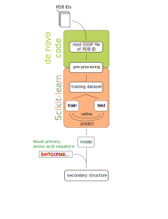

# Johns Hopkins University - Whiting Engineering

## Prediction of Protein Secondary Structure using Machine Learning
Final Project - Algorithms for Structural Bioinformatics (605.751)

The project is focused on using machine learning to predict the secondary structure of a primary
amino acid sequence. It uses structural information from DSSP files. The DSSP structure categories
have been mapped to three secondary structures: alpha helix, beta sheet, and coil.

## Architecture


## Development Environment
We used Python 3.6 and 3.9. Create a [virtual environment](https://docs.python.org/3/tutorial/venv.html) with
any of these versions and activate it. Then install or update the dependencies by running:
```bash
pip install -r requirements.txt
```
Currently you need a copy of the [DSSP library](https://swift.cmbi.umcn.nl/gv/dssp/) on your
disk (~ 29 GB). Copy the DSSP files into a directory named `dssp` and in `settings.ini` set the
path to directory `dssp` on your local system.

## Run `pred-sec-struc`

`pred-sec-struc` is a command line application. Run the following for more information on the syntax:
```bash
python pred-sec-struc.py -h
```
`pred-sec-struc` uses a list of 107 globular proteins from [Qian & Sejnowski (1988)](https://papers.cnl.salk.edu/PDFs/Predicting%20the%20Secondary%20Structure%20of%20Globular%20Proteins%20Using%20Neural%20Network%20Models%201988-3749.pdf),
Table 1, to create a model to predict the secondary structure of a primary sequence based on the sequence
alone. The model was trained with a neural network, a form of supervised learning. Specifically, it
uses a multi-layer perceptron with 13 hidden units and 2 hidden layers.


## Tests
To run all test open a terminal and run:
```bash
python -m unittest
```


